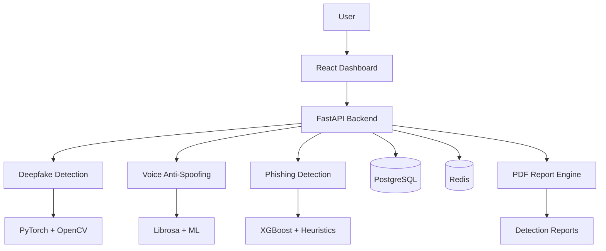

# 🛡️ KAVACH AI Pro

### AI-Powered Deepfake, Voice Spoofing & Phishing Detection Platform

KAVACH AI Pro is a full-stack cybersecurity platform designed to detect modern social-engineering threats using Machine Learning and heuristic analysis.

### Key Features

* 🎭 Deepfake Video Detection
* 🎙️ Voice Anti-Spoofing Analysis
* 🎣 Phishing URL Detection
* 📊 Real-Time Security Dashboard
* 🔐 JWT Authentication & RBAC
* 📑 PDF Report Generation
* ⚡ FastAPI + React Architecture
* 🐳 Docker Deployment Support

## Tech Stack

**Backend**

* FastAPI
* PostgreSQL
* Redis
* SQLAlchemy

**Frontend**

* React 18
* Tailwind CSS
* Zustand

**AI / ML**

* PyTorch
* OpenCV
* Librosa
* XGBoost
* Scikit-Learn

## Architecture

See architecture diagram below.



## Screenshots


## Installation

```bash
docker-compose up -d --build
```

## License

MIT License
